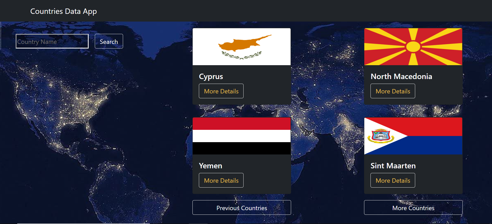
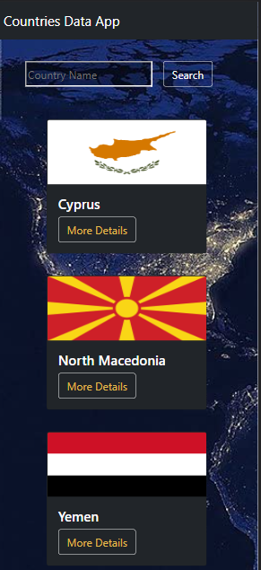

# Countries App

Search for a country to see some of his info and the weather of his capital city with the OpenWeatherMap API and Rest Countries API.

Includes:

1.  Main page with countries flags.
2.  View with country details.
3.  View with country capital city weather.
4.  Searcher
5.  Responsive Design.

# Deployment

VERCEL:

[LINK](https://countries-app-hazel.vercel.app/)

## Screenshots

Desktop version:

Mobile version:

## Libraries and tools

1.  [REACT](https://en.reactjs.org/)
2.  [REACT ROUTER](https://reactrouter.com/)
3.  [REACT BOOTSTRAP](https://react-bootstrap.github.io/getting-started/introduction/)

## Install and run project

1. Clone repo.
2. Install modules `npm install`.
3. Make an account and get an api key in [OpenWeather](https://openweathermap.org/api).
4. Check .env.example file and create a `.env` file.
5. Run project `npm start`.
